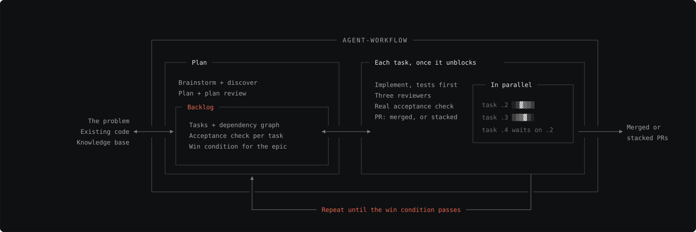

# agent-workflow

SWE is building what people want. This repo allows us to effectively automate the overhead surrounding that so we can focus on what matters. It houses a set of Claude Code skills, commands and hooks for building with multi-agent workflows.

## The problem

One agent cannot hold a whole project in its context window. Give it a large feature and it forgets what it read at the start by the time it reaches the end. "Done" is often ambiguous and tests passing aren't always the best eval for a passing unit of work.

## The approach

Humans and agents need to understand two things before they write any code:

1. **The scope and flavor of the task.** What problem is this, who has it, what stays broken without a fix, and what already exists in the codebase…etc
2. **The mechanics.** Which files, in what order, checked by what command.

The harness gets agents to both with a loop.



1. **Brainstorm and discover.** Humans braindump down what we think we know. The agent answers from the knowledge base and the code, and reports what it could not confirm. We go back and forth until that list is empty or deliberately deferred.
2. **Plan.** The planner writes the tasks and a plan reviewer adversarially reviews them. We repeat until the reviewer approves.
3. **Backlog.** The plan becomes units of work: what it is, why it exists, what breaks without it, and the deterministic check that proves it. The backlog also holds the **win condition**, one end-to-end check for the whole epic that runs in a dev copy of the system, never in prod.
4. **Work, once per task.** A fresh agent takes each task that has unblocked, in its own worktree: tests first, three reviewers, the task's real acceptance check, then a PR. Tasks that do not depend on each other run at the same time.
5. **Merge or stack, then go around again.** If it fails, the failure becomes new tasks. The loop ends when the win condition passes.

## Commands

**Core workflow**

| Command | What it does |
| --- | --- |
| `/plan <description>` | Explore the code, discuss the approach with you, file tasks with dependencies and a win condition, run the plan reviewer |
| `/work <id-or-description>` | Implement, review and open a PR per task. With a win condition, can loop until the check passes |
| `/pr [branch]` | Regenerate a PR summary after more commits |
| `/merged [branch]` | After you merge: close the task, clean up, unblock dependents |
| `/epic <id>` | Redirects to `/work` |
| `/setup-remote` | Share the task database across machines through DoltHub |

**Utility**

| Command | What it does |
| --- | --- |
| `/review <source>` | Process external review feedback and fix the harness so the same miss does not recur |
| `/handoff` | Write an end-of-session briefing for a fresh agent |
| `/prune` | Find dead code, with a reason attached to each verdict |
| `/gh-issue` | File a GitHub issue |

**Skills you ask for by name**

| Skill | Use it for |
| --- | --- |
| `discover` | Check what is true before planning. Reads the knowledge base first, then sends read-only sub-agents to verify the rest |
| `document` | Keep a living HTML page for a topic. Short plain-language sections for you, a collapsed "For agents" section that holds notes and links |
| `win-condition` | Define the end-to-end check for an epic |
| `quick` | Small, low-risk fixes. One reviewer instead of three, still a real branch and PR. It refuses anything risky and hands off to `/work` |
| `copy-harness` | Install this harness in another repo |

## Quick start

1. Copy `.claude/` and `AGENTS.md` into your project (or run the `copy-harness` skill from a checkout of this repo).
2. Replace `CLAUDE.md` with your project's build, test and lint commands, and the dev environment an agent can safely break.
3. `/plan "your feature"`, then `/work <epic-id>`.

## How it works

[EXAMPLE.md](EXAMPLE.md) walks one feature through the whole loop: a new endpoint on an app that already has several.

In short: `/plan` turns a feature into tasks with dependencies and a win condition. `/work` takes the unblocked tasks, gives each to an implementer in its own worktree, runs three reviewers in parallel and opens a PR. By default you merge each PR before the next task starts, and `/merged` closes the task and unblocks it. In autonomous mode the coordinator stacks PRs on each other and loops until the win condition passes. Merges stay yours either way.

## Looping the plan review

`/plan` runs the plan reviewer once after the tasks are filed, and shows you what it found. To keep going until it approves, say so in the same message: "run the plan reviewer again after each fix until it approves." The harness does not loop on its own. You decide when you trust the plan.

## Parts you can swap

The loop is the same everywhere. These pieces are the ones this repo happens to use, and each has a plain-language role you can fill another way.

| Role | Used here | Another way |
| --- | --- | --- |
| Task tracker with dependencies | [beads](https://github.com/jdelfino/beads) on Dolt | Any tracker where a task can block another and carry a long description |
| Isolated workspace per task | git worktree | A separate clone or container |
| Code host and PRs | GitHub and `gh` | Any host with pull requests |
| Dev copy of the system | A database branch plus a dev deploy | A docker-compose stack, a staging environment, a seeded local database |
| Quality gates | Commands listed in `CLAUDE.md` | Whatever your project runs in CI |

The win condition and the per-task acceptance check have to run against the dev copy, so that is the one row you cannot leave empty.

## Architecture

```
.claude/
  commands/         Slash command routers (plan.md, work.md, merged.md, ...)
  skills/           Agent behavior
    coordinator/    Picks tasks, runs implementers and reviewers, opens PRs
    planner/        Turns a request into tasks and a win condition
    implementer/    Test-first development in one worktree
    reviewer-*/     Plan, correctness, tests, architecture
    win-condition/  Defines the end-to-end check for an epic
    discover/       Knowledge-base lookup and read-only verification
    document/       Living HTML page for a topic
    quick/          Lightweight flow for small fixes
    standards/      Shared rules injected into reviewers
  agents/           Subagent definitions (implementer, quick-reviewer)
  hooks/            Task-database sync, and a check that reviewers got their standards
  settings.json     Permissions, plugins, hooks
AGENTS.md           Loaded into every session: workflow rules and task tracker usage
CLAUDE.md           Your project's build, test and lint commands
.beads/             Task database (Dolt)
```

## Requirements

- [Claude Code](https://claude.ai/code) CLI
- [beads](https://github.com/jdelfino/beads) and [Dolt](https://docs.dolthub.com/introduction/installation)
- `gh` CLI, authenticated
- git, `jq`, `python3` (the `discover` skill's index script)

## License

MIT